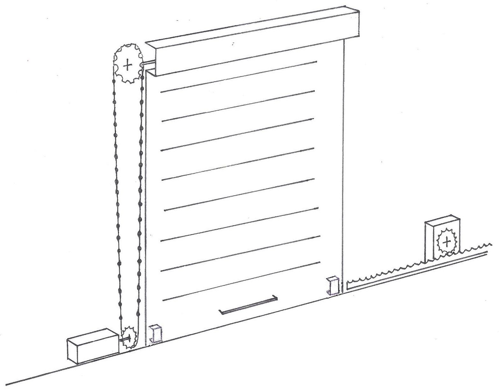
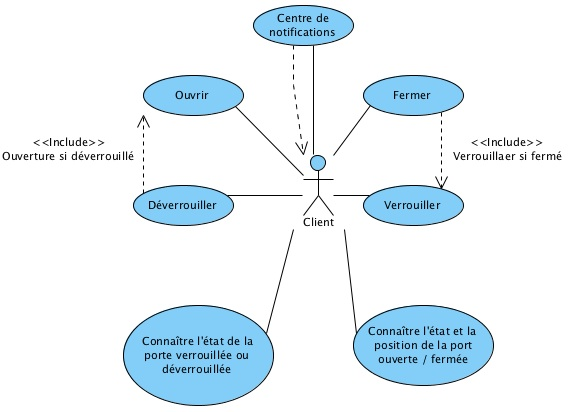

# Rideau de fer
> Service Web permettant de contrôler un rideau de fer. Implémenté grâce au framework [jersey](https://jersey.java.net).

## Description
Ce projet a pour but de relier un rideau de fer au Web. Un rideau de fer d’un bâtiment est un rideau métallique pouvant se relever et s’abaisser grâce à un axe rotatif horizontal fixé à son sommet. Le rideau peut également être verrouillé/déverrouillé grâce à une barre horizontale empêchant ainsi son ouverture/fermeture.

### Fonctionnement mécanique
Le rideau est actionné de manière mécanisée grâce à un moteur à rotation continu, de même que la barre de fermeture. Afin de connaître la position du rideau et son état (verrouillé/déverrouillé), deux potentiomètres linéaires sont utilisés. Toutes les actions effectuées par les moteurs peuvent être également effectuées manuellement, même si le changement d’état du rideau sera toujours transmis au serveur.Le schéma ci-dessous donne une idée générale du type de rideau de fer qui a été implémenté et construit.


### Fonctionnement eléctronique
Pour piloter les deux moteurs et connaître la valeur des potentiomètres linéaires, nous utilisons un micro-contrôlleur [Arduino](arduino.cc). La communication entre le service Web et l'Arduino se fait par le port série au moyen d'un câble USB.

### Cas d'utilisation
Chaque porte doit posséder sa propre adresse IP et être contrôlable à travers le protocole HTTP. C’est à dire, qu’il est possible de la manipuler depuis un navigateur Web. De plus, le serveur Web doit suivre l’architecture RESTful et retourner les données sous différents formats, XML et JSON. Le serveur doit également être capable d’envoyer des événements aux clients enregistrés. Une interface client Web, utilisant les standards du Web, doit être fournie afin de gérer les différentes portes d’un magasin.

Ci-dessous, le diagramme décrit les différentes actions pouvant être effectuées sur la porte.

Pour des questions de lisibilité, nous avons décidé de na pas illustrer la gestion des notifications et de ne pas différencier la manipulation physique de la manipulation virtuelle.

Il est important de noter l’ordre dans lequel les actions peuvent s’effectuer. En effet, toutes ne sont pas indépendantes les unes des autres. L’action de verrouiller le rideau peut s’effectuer uniquement si le rideau est fermé et l’action d’ouverture peut s’effectuer uniquement si le rideau est déverrouillé. Fermer le rideau reste toujours possible puisqu’il n’est pas interdit de fermer un rideau fermé, ce qui équivaut à ne rien faire. L’ordre dans le quel doivent s’effectuer ces actions n’est pas dû au fait que notre rideau soit un Smart-device, mais est dû à sa conception qui découle de sa fonction même.

## Motivation
La principale motivation est de créer une porte virtuelle, exposée au Web, représentant le rideau de fer. Ainsi, une nouvelle façon d’interagir avec un rideau de fer apparaît. En effet, chaque appareil possédant un navigateur Web peut y accéder depuis n’importe où, différentes interfaces peuvent être créées et utilisées à volonté pour diriger le même rideau, il est possible de regrouper tous les rideaux d’un certain type dans une même application (l'[interface client](https://github.com/facenord-sud/DoorClient) de ce projet en est un exemple basique), créant ainsi une application composite (Mash-up). Sans compter énormément d’autres possibilités que nous offrent le Web.

#### Actuellement
Au temps actuel, la gestion d’un rideau de fer est basique. Au mieux quelques interfaces peuvent être utilisé pour diriger le même rideau, par exemple, en l’ouvrant manuellement, au moyen de boutons-poussoirs ou avec une télécommande. Bien qu’il existe déjà des moyens de commander à distance un rideau de fer, il est nécessaire de posséder une télécommande dédiée. Mais qui ne c’est pas déjà plaint du nombre de télécommandes envahissants le quotidien ? De plus les rideaux de fer actuels ont beaucoup de peine à communiquer entre eux ou avec d’autres applications.

####Transformer le rideau de fer en Smart Device
Un avantage de transformer le rideau de fer en Smart Device (objet intelligent) est de permettre à une personne, ayant le droit de le faire, de manipuler le rideau depuis n’importe quel smartphone, tablette ou ordinateur. En effet, la seule contrainte est de posséder un terminal, avec un navigateur web et une connexion Internet. Ce qui, avec le développement technologique des dernières années est le cas de presque tout le monde.

#### Interaction manuelle et virtuelle
Bien que le rideau soit exposé au Web des objets, il doit toujours être possible qu’il puisse être manipulé manuellement, en se passant de l’interaction avec le monde virtuel. Ainsi, relier un objet au Web ne créée rien de nouveau, mais au contraire ajoute une dimension à l’objet, lui permettant de se situer dans deux réalités différentes à la fois. Si bien que, même si le rideau est piloté manuellement, son changement d’état sera toujours retransmis au serveur et donc visible depuis le monde virtuel.

#### Notifications
Grâce aux définitions fournies par le xWoT méta-modèle, une application de ce type donne la possibilité de s’enregistrer pour un certain types d’événements. C’est à dire :
* ouverture/fermeture
* verrouillage/déverrouillage

Cela permet notamment la création d’alertes si le rideau change d’état alors qu’il ne devrait pas. Par exemple, si quelqu’un relève le rideau pendant la nuit ou si le rideau est baissé pendant l’ouverture du magasin.

#### Mash-ups
Finalement, cela offre la possibilité de gérer plusieurs portes d’un magasin. Puisque, chaque rideau possède une adresse IP unique, il est facile de concevoir un site web regroupant toutes les portes d’un magasin. Nous arrivons ici aux principes des Mash-ups ou applications composites qui sont des applications interrogeant différentes autres applications du même types. Dans le Web actuel, un site de comparateur de prix de billets d’avions est un Mash-up puisqu’il utilise les données de différents autres applications Web afin d’afficher différents prix pour un billet d’avion. Dans le cas du Web des Objets, nous pouvons imaginer un bâtiment dont les stores de chaque fenêtres sont reliés au Web et un Mash-up s’occuperait de répertorier tous les stores, d’indiquer ceux ouverts, de permettre la manipulation des stores sous certaines contraintes et même, par exemple, d’empêcher qu’un trop grand nombre de stores exposés à un fort ensoleillement soient montés en même temps. Permettant ainsi conserver une température agréable et évitant de recourir à la climatisation.

## Structure
La strucuture de l'application est cele générée par l'archetype [RESTArduinoArchetype](https://github.com/facenord-sud/RESTArduinoArchetype).

A noter encore que la classe [`diuf.unifr.ch.first.xwot.components.ArduinoComponents`](https://github.com/facenord-sud/FirstXwot/blob/master/FirstXwotServer/src/main/java/diuf/unifr/ch/first/xwot/components/ArduinoComponents.java) indique sur quel pin de l'Arduino chaque composant est connecté.

## Implémentation
Il y a deux partie de l'implémentation à distinguer. La première est l'interaction avec l'Arduino, tandis que la deuxième est la création du service Web.

### Interaction avec l'Arduino
Pour communiquer avec l'Arduino nous utilisons la bibliothèque[ArduinoCommunication](https://github.com/facenord-sud/ArduinoCommunication) qui utilise la bibliothèque java [RxTx](http://www.rxtx.org). Les données sont encodées au format JSON. Pour plus d'informations, consulter le répertoire [ArduinoCommunication](https://github.com/facenord-sud/ArduinoCommunication).

#### Connaître l'état d'un composant
Afin de connaître l’état d’un de nos composant, par exemple, un potentiomètre linéaire, un code similaire à  celui ci-dessous est utilisé.

```java
// The RxtxUtils class is used to deal with ease with data from arduino
RxtxUtils utils = new RxtxUtils();
// LinearPotentiometer is filled with the data corresponding of the lock action linear potentiometer
LinearPotentiometer lp = utils.getComponent(LinearPotentiometer.class,
ArduinoComponents.LOCK_SENSOR);
```

La ligne numéro deux initialise une classe dont une des méthodes simplifie l’utilisation de la bibliothèque GSON, permettant de lire facilement les données envoyées par l’Arduino. La ligne numéro quatre prend la dernière chaîne de caractères JSON envoyée par l'Arduino, la parse et assigne à la classe `LinearPotentiometer` les valeurs contenues par la chaîne de caractères JSON. Tout le code utilisé dans cette exemple a été développé par nos soins

#### Modifier l'état d'un composant
Afin de modifier l’état d’un composant, comme par exemple faire tourner à plein régime un moteur, nous utilisons un code similaire à l'exemple ci-dessous.

```java
// The RxtxUtils class is used to deal with ease with data from arduino
RxtxUtils utils = new RxtxUtils();
// The class representing a continious servo on arduino
ContiniousServo cs = new ContiniousServo();
// We set the speed to max speed for openine the door
cs.setSpeed(ContiniousServo.OPEN_MAX_SPEED);
// We add the data of th cs to the datas that will be send to the arduino
// We send to arduino datas for the servo of the lock action
utils.addComponent(ArduinoComponents.LOCK_SERVO, cs);
// Data are sended to arduino
utils.send();
```

A nouveau, tout le code utilisé ici provient de la dépendance ArduinoComunication. La ligne numéro six assigne la valeur de la vitesse maximale à une instance de la classe représentant un composant Arduino en Java, Puis, à la ligne numéro neuf, les valeurs de l’instance précédemment mentio née sont encodées en JSON et identifiées par le port de l’Arduino au quel est connecté le moteur de déverrouillage du rideau de fer. Finalement, à la ligne numéro onze, les données sont envoyées à l’Arduino, qui, quand il les recevra, fera tourner à plein régime le moteur de déverrouillage de la porte. Si dans un premier temps, nous préparons les données à envoyer puis nous les envoyons, c’est pour la simple raison qu’il est possible de transmettre plusieurs informations à la fois à l’Arduino. Par exemple, il aurait été possible d’également modifier la vitesse du moteur d’ouverture du rideau de fer et d’envoyer toutes les informations en une fois.

A noter que la classe  `LinearPotentiometer` est une classe de la dépendance Maven [ArduinoComponents](https://github.com/facenord-sud/ArduinoComponents), également développée par nos soins.

### Implémentation des ressources
L'implémentation des ressources du service Web est fait de manière classique comme n'importe quelle application Jersey. La différence est qu'à la place d'interroger une base de données, nous interrogeons un objet piloté par un Arduino. Ce qui est similaire sur de nombreux points, puisque l'Arduino envoie également des données qui sont transformées en classe JAXB. De même que les informations envoyées par l'utilisateur et transformées en classes JAXB permettent de modifier l'état de l'Arduino.

Pour une requête GET le principe est le suivant:

1. Aller lire l'état du composant requis
2. Les informations de l'instance de la classe représentant le composant sont transformées en une classe JAXB
3. Envoyer cette classe JAXB à l'utilisateur

Pour une requête PUT:

1. Récuperer la classe JAXB contenant  les informations envoyées par l'utilisateur
2. En fonction de ces informations, modifier l'état de l'Arduino
3. Retourner quelque chose à l'utilsateur

### Implémentation des notifications
Une partie de notre travail, consistait à implémenter un système de notifications (Webhooks). C’est- à-dire envoyer des requêtes POST vers un serveur client à chaque changement d’état de l’Arduino. Ceci est appelé un publisher dans notre travail.

L’implémentation d’un publisher peut être séparées en deux phases.

#### Première phase : implémentation des méthodes
Nous avons défini qu'un publisher possède quatre méthodes. Trois en interaction directe avec le client et une pour lister tous les clients enregistrés pour un certain type d’événement. Afin de retourner une liste de tous les clients enregistrés et sans utiliser une classe JAXB supplémentaire qui alourdirait l’ensemble pour une seule méthode, nous avons développé ce code un peu spécial qui se trouve ci-dessous :

```java
@GET
@Produces({"application/xml", "application/json", "text/xml"})
public Response getLockClientsResourceXML() {
    List<Client> clients = new ArrayList<Client>() {
};
for (Object o : NotificationFactory.getInstance().getLockNotification().getClients()) {
    clients.add((Client) o);
}
final GenericEntity<List<Client>> list = new GenericEntity<List<Client>>(clients)
{ };
    return Response.ok(list).build();
}
```

Pour des raisons de rapidité et simplicité, lors de l’enregistrement et de l’accès aux clients d’un publisher, nous ne stockons pas ces clients dans une base de données, mais directement dans la mémoire vive du serveur grâce à une simple liste de clés-valeurs, une classe `HashMap` en Java. Le désavantage est bien évidemment que si le serveur est arrêté, les client enregistrés sont perdus. Une solution adapté à nos besoins serait d’utiliser une base de données [Redis](redis.io).

Afin d’accéder aux informations d’un client spécifique, identifié par son URL, nous utilisons ce code :

```java
NotificationFactory.getInstance().getLockNotification().getClient(uri);
```

Le listing ci-dessous montre comment nous avons procédé afin d’enregistrer ou de mettre à jour l’inscription d’un client pour un certain événement.

```java
@PUT
@Path(uriPattern)
@Consumes({"application/xml", "application/json"})
@Produces({"application/xml", "application/json", "text/xml"})
public Response putLockClientResourceXML(Client client, @PathParam("uri") String uri){
    client.setUri(uri);
    NotificationFactory.getInstance().getLockNotification().addClient(client.getUri(), client);
    return Response.ok(client).build();
}
```

Les lignes une à cinq n’ont rien de particulier et sont semblables à n’importe quelle méthode d’une classe de ressource Jersey. Par contre, à la ligne numéro sept, nous utilisons une classe implémentant le pattern Singleton et Factory créée par nos soins. Une des méthodes de cette classe (`getLockNotification`) permet de retourner toujours la même instance de la classe `LockNotification` s’occupant d’enregistrer les clients pour les événements de type lock. C’est à dire quand le rideau de fer est verrouillé/déverrouillé. La classe `LockNotification` utilise un `HashMap` pour stocker tous les clients enregistrés, identifiés par leur URL, d’où la méthode `addClient()` dont le premier paramètre est la clé et le deuxième la valeur. Procéder de la sorte, et grâce au principe de la classe `HashMap`, comporte l’avantage que la méthode utilisée est la même pour modifier ou enregistrer une inscription. Finalement, la ligne numéro neuf renvoie au client les données qu’il nous a lui-même fournies. Nous procédons de la sorte puisque cela permet au client de valider si son inscription s’est effectuée correctement.

A noter, que nous utilisons le pattern Factory associé au pattern Singleton avec eager loading afin d’avoir accès tout au long de l’exécution au mêmes informations dans tous les publishers. Nous utilisons le eager loading, car, après une phase de debuggage particulièrement longue, il est apparu que le lazy loading posait problème au niveau du multi-threading.

####Deuxième phase : Envoi de requêtes POST (notifications) au serveur client.

L’envoi de notifications vers les clients est séparé en deux partie distinctes. Premièrement L’envoi de la notification grâce à un client HTTP. Deuxièmement, décider à quel moment envoyer une notification.

1. L’envoi de la notification est fait dans la bibliothèque [ArduinoCommunication](https://github.com/facenord-sud/ArduinoCommunication) implémenté par nos soins.
2. Déterminer quand l’envoi d’une notification est nécessaire est implémenté partiellement dans la dépendance citée précédemment et doit être complété pour chaque publisher.

Afin de faciliter l’implémentation pour chaque publisher, la dé- pendence utilise le pattern builder. Ainsi, il ne reste plus qu’à créer un sujet pour chaque publisher.

Un sujet est composé de deux méthodes redéfinies. La première détermine quand envoyer la notification. Tandis que la deuxième, `isEqualTo`, est implémentée dans la classe JAXB de `Lock`. Elle permet de comparer l’état d’un composant Arduino à un autre et de déterminer s’ils sont équivalent ou non.

Cette deuxième méthode permet en outre de déterminer comment et sous quel format les données doivent être envoyées au client. Dans notre cas, le code est trivial, mais cette méthode a été créée afin de prendre en compte le fait que chaque client peut avoir une manière bien à lui de vouloir recevoir les données.
